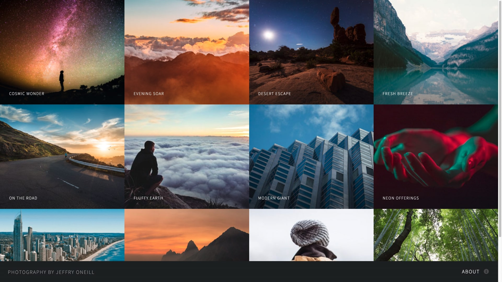

# Jeffry Oneil Photography : <a target="_blank" href="https://jeffryoneilphotography.netlify.app/">Visit Here</a>

### An online showcase of a collection of photographs by photographer Jeffry Oneill.

## Tech used: 

My focus was creating a seamless experience.

## Optimizations

My next steps for improving this project would be to create a carousel with JavaScript that automatically changes images.

## Lessons Learned:

I learned to use modals effectively and conserve image quality when downloading/importing them.

## More Projects

<table bordercolor="#66b2b2">
  
  <tr>
    <td width="33.3%"  style="align:center;" valign="top">
<a target="_blank" href="https://github.com/Cesar-Quintero/Cesar-Quintero-Portfolio-Website">Portfolio Website</a>
         
      
    </td>
    <td width="33.3%" valign="top">
<a target="_blank" href="https://github.com/Cesar-Quintero/Coiffeur">Coiffeur</a>
       
        
    </td>
    <td width="33.3%" valign="top">
<a target="_blank" href="https://donutking.netlify.app/">Donut King</a>
         
        
    </td>
  </tr>
</table>